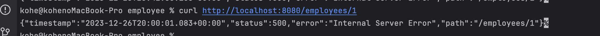
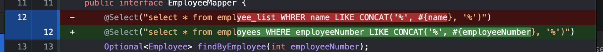
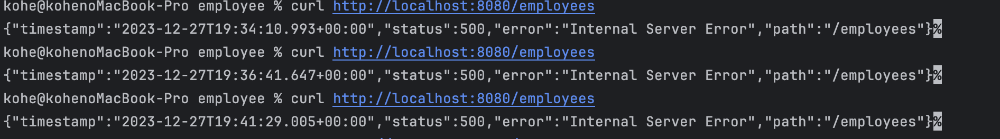
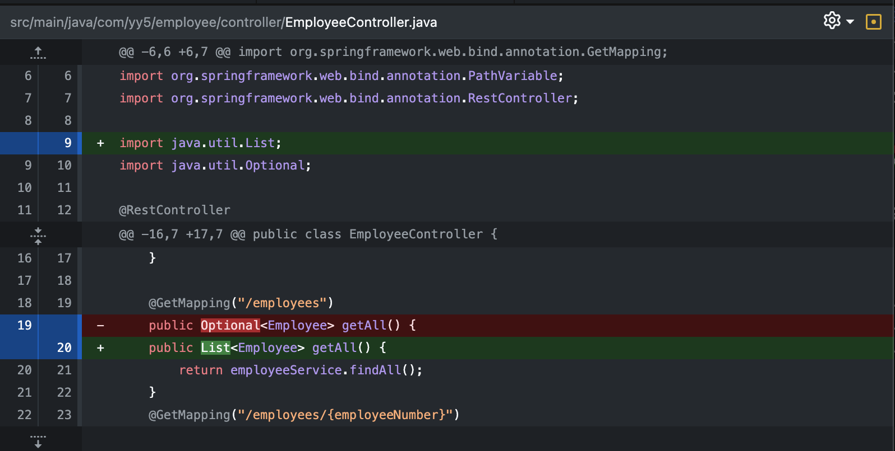
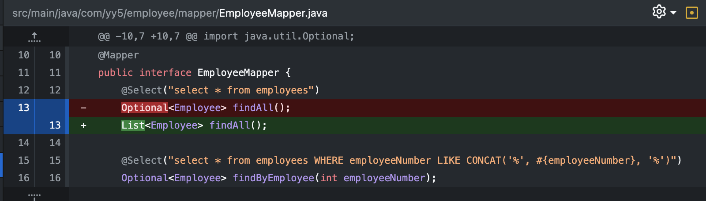
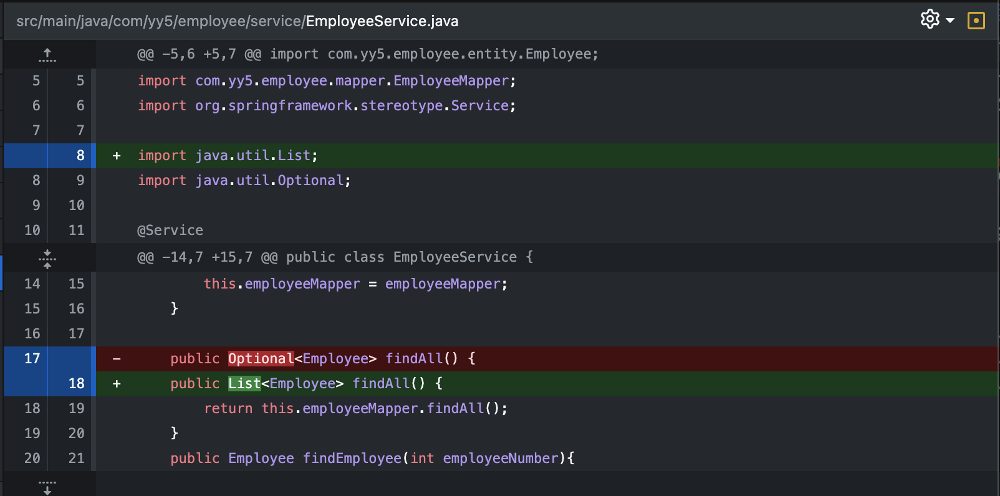
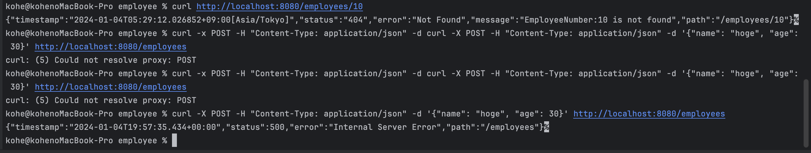
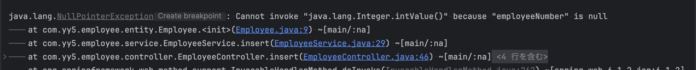
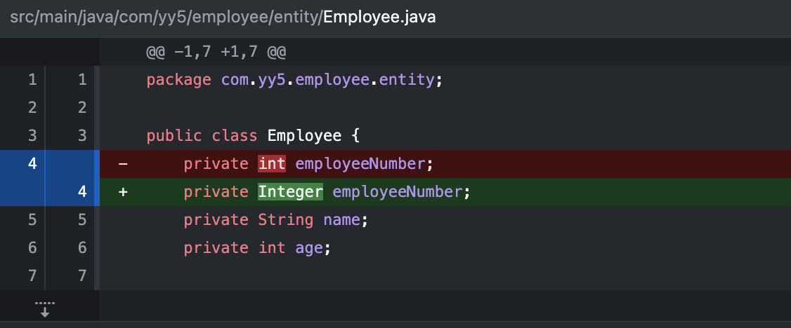
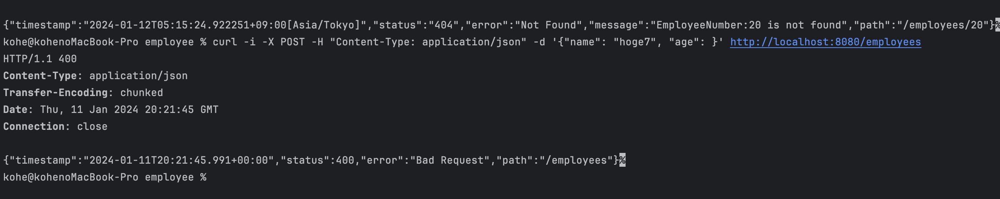

# CRUD処理を備えたRestAPIの作成

### 概要

職員番号を主キーとし、氏名と年齢をカラムにもつSQLを作成しています。

### CRUD処理の実装

- Read処理
  - employeeNumber検索(パスパラメータ検索)の実装
  - 全件検索及び部分一致検索(クエリパラメータ)の実装
  - エラーハンドリングの実装


- Create処理
  - 新規登録機能の実装
  - レスポンスボディの設定
    - ステータスコード201でレスポンス
    - 新規登録時に「employee created」のメッセージを表示させる
<<ここまで実装完了>>
  - エラーハンドリング
    - ageカラムが整数意外だった場合「整数を入力してください」というエラーメッセージを表示させる
    - Nameにバリデーションを追加する


- Update処理
  - 今後実装


- Delete処理
  - 今後実装


### データベース作成時の内容

| **employeeNumber** | **name** | **age** |      
|:------------------:|:--------:|:-------:|  
|         1          |  スティーブ   |   21    |  
|         2          |   マーク    |   20    |  
|         3          |   ジェフ    |   30    |  

### 実装時間
R5  
12.25　2時間  
12.26　1時間30分  
12.27　1時間  
12.28　2時間  
12.31　1時間

R6  
1.3　2時間  
1.4　2時間  
1.5　2時間  
1.8　1時間30分  
1.9　2時間  
1.11　1時間30分  
1.12　2時間  
1.14　2時間  
1.15　1時間  
1.16　2時間  
1.17　2時間  
1.18　2時間  
1.19　2時間  
1.22　1時間  
1.23　2時間  
1.24　1時間
1.30　1時間  

### エラーの共有と解決方法
#### Dockerの構築ができない
Dockerの構築を行う際
```
Creating employee_list ...
Creating employee_list ... error

ERROR: for employee_list  Cannot start service db: driver failed programming external connectivity on endpoint employee_list (85ba989733902f15c2b8ccfa5e4b443212d780d479ec48c292d38b503f930223): Bind for 0.0.0.0:3307 failed: port is already allocated

ERROR: for db  Cannot start service db: driver failed programming external connectivity on endpoint employee_list (85ba989733902f15c2b8ccfa5e4b443212d780d479ec48c292d38b503f930223): Bind for 0.0.0.0:3307 failed: port is already allocated
ERROR: Encountered errors while bringing up the project.
```
というエラーが発生
これは
`:3307 failed: port is already allocated`
という内容から
`ポート3307はすでに使用されています`
という意味でした。
ですのでDockerの今まで作成したContainers・Images・Volumesを削除することにより解決しました。

#### cURLコマンドを入力しても500エラーになる
エラー状態


エラーメッセージ
```
### Error querying database.  Cause: java.sql.SQLSyntaxErrorException: Table 'employee_list.employee_list' doesn't exist
### The error may exist in com/yy5/employee/mapper/EmployeeMapper.java (best guess)
### The error may involve com.yy5.employee.mapper.EmployeeMapper.findByEmployee-Inline
### The error occurred while setting parameters
### SQL: select * from employee_list WHERE employeeNumber LIKE CONCAT('%', ?, '%')
### Cause: java.sql.SQLSyntaxErrorException: Table 'employee_list.employee_list' doesn't exist
; bad SQL grammar []] with root cause

java.sql.SQLSyntaxErrorException: Table 'employee_list.employee_list' doesn't exist
```

解決方法

`Table 'employee_list.employee_list' doesn't exist`
というエラーメッセージから、
`employee_listデータベースのemployee_listテーブルを検索しようとしているが存在しない。`
ということが読み取れる。実装としてはemployee_listデータベースののemployeesテーブルを読み込んで欲しかったのでMapperを修正することで解決しました。


#### 全件検索を行なっても、１つの結果を返されることが期待されてエラーになる
エラー状態


エラーメッセージ
```
org.apache.ibatis.exceptions.TooManyResultsException: Expected one result (or null) to be returned by selectOne(), but found: 3
```

解決方法

`Expected one result (or null) to be returned by selectOne(), but found: 3`
というエラーメッセージから、
`１つの結果を期待しているが３つの結果が見つかった`
ということが読み取れます。
結論から言うと原因はOptionalでレンスポンスをしていることでした。
Optionalは１つのレコードかNullの結果しかレスポンスしません。
よってOptionalからListに変更したところ解決しました。




#### 新規登録ができない
エラー状態



エラーメッセージ
```
java.lang.NullPointerException: Cannot invoke "java.lang.Integer.intValue()" because "employeeNumber" is null
```

解決方法

`NullPointerException: Cannot invoke "java.lang.Integer.intValue()" because "employeeNumber" is null`
というエラーメッセージから、
`employeeNumberがnullのため実行できない`
ということが読み取れます。
結論から言うと原因はint型でemployeeNumberを定義していることでした。
新規登録を行う場合、Serviceクラスで一旦空のemployeeNumberを作成しておき、Mapperに渡った時insertメソッドで自動採番されます。
ですのでemployeeNumberはnullを許容できる必要がありますがint型の場合はnullを許容できません。
よってInteger型に変更することで、エラーを解消しました。



#### 社員登録処理のエラーメッセージが表示されない
エラー状態


エラー内容  
社員情報を登録する方法としてageにint型を設定していますが、空や整数以外の内容が入力された場合
「無効な年齢です」というメッセージを表示させようとしていますが、エラーメッセージが表示されません。

解決方法
ageカラムにバリデーションを設ける。

#### @NotBlankでは全角スペースに対応していない
エラー内容  
Ageカラムが全角スペースでリクエストを送った場合、バリデーションが実行されず、４００Bad _Requestメッセージが返される。

解決方法